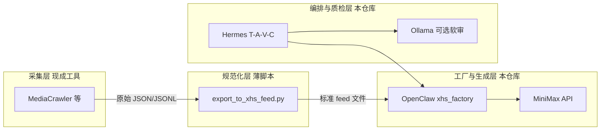

# 小红书数据与工厂 — 方案、架构与技术指南

本文说明：**如何用现成工具**把「真实/半真实笔记样本」接入当前仓库的 **小红书流量工厂**（挖掘 → 二创 → 预测 → 整理待发），并与 **Hermes / OpenClaw / MiniMax / Ollama** 的职责划分对齐。

- **若你更想要「爬虫要满足什么 + Cursor 双文件夹逐步点哪里」**：请看 **`爬虫与工厂-对接清单与双文件夹打开步骤.md`**（勾选清单 + 菜单路径）。
- **为何单独成文**：`使用说明书.md` 偏操作步骤；`EVOLUTION.md` 偏决策与演进；本文偏 **方案边界、架构分层、数据契约与工具选型**。
- **原则**：**优先成熟开源 + 标准协议（HTTP、JSON、Docker、环境变量）**，避免自研爬虫与主业务代码强耦合。

---

## 1. 要不要「新项目」？

- **主工程**：始终是你当前的 **`ai封装` 仓库**（Hermes +本仓库 OpenClaw 容器 + 配置）。
- **爬虫**：使用 **现成的 MediaCrawler**（或其它工具），放在 **独立目录**（与 `ai封装`平级，或 `ai封装` 下子目录并 **`.gitignore`**），通过 **文件或 HTTP** 输出数据即可。
- **不要求**把爬虫源码合并进主仓库；**不要求**为爬虫单独再开一个「替代 ai封装」的工程。

---

## 2. 总体架构（逻辑分层）

系统可理解为四层；**采集与生成解耦**，中间只认 **JSON 契约**。



| 层级 | 职责 | 推荐现成技术 |
|------|------|----------------|
| 编排 | 会话、步骤、重试、与 OpenClaw 异步对接 | **本仓库 Hermes**（FastAPI +既有 runner） |
| 生成与工厂算子 | `extract` / `recreate` / `predict` / `prepare_xhs` | **本仓库 OpenClaw** + **MiniMax**（`minimax_client`） |
| 采集 | 登录、反爬、浏览器环境 | **MediaCrawler**（Python + Playwright，社区活跃） |
| 数据落地 | 合并、字段映射、写成数组/JSONL | **本仓库** `scripts/export_to_xhs_feed.py` + **UTF-8 JSON文件** |
| 容器与配置 | 一致运行环境、密钥注入 | **Docker Compose** + **`.env`**（与 `.env.example` 对齐） |
| 本地脚本与联调 | 一键跑通任务 | **PowerShell**（如 `bench-hermes-xhs-sync.ps1`） |

---

## 3. 数据流与集成点（文件级）

1. **MediaCrawler（或其它工具）** 在宿主机某目录产出导出文件（具体文件名、嵌套结构以工具版本为准）。
2. 在 **`ai封装` 仓库根目录** 执行：

   ```powershell
   Set-Location -LiteralPath "D:\ai封装"
   python scripts\export_to_xhs_feed.py --in "导出路径\..." --out "openclaw\data\xhs-feed\samples.json"
   ```

   或使用 `--topic` + `--out-dir` 生成与话题 slug 对应的 `{16位hex}.json`（与 `openclaw/xhs_factory.py` 内 `_topic_file_slug` 一致）。

3. 在 **`.env`** 中配置其一（详见 `.env.example`）：
   - **`XHS_FACTORY_SAMPLES_PATH`**：单个 JSON 数组或 JSONL 文件；
   - **`XHS_FACTORY_FEED_DIR`**：目录内优先 `{slug}.json`，否则 `samples.json` / `feed.json`；
   - **`XHS_FACTORY_FEED_URL`**（可选）：HTTP GET 返回 JSON 数组，`topic`、`limit` 由工厂自动拼在查询串上。

4. **重启或重建**依赖镜像的 OpenClaw 服务（若仅改 `.env` 与挂载目录内文件，通常 `docker compose up -d` 即可；改代码则需 `build`）。

5. **Hermes** 侧仍通过既有 **`POST /task/sync`** 等路径驱动 goal；工厂是否读到真实样本，取决于 OpenClaw 进程是否读到上述环境变量与文件。

---

## 4. 样本契约（工厂内部「最小够用」字段）

OpenClaw 在 `xhs_factory._normalize_external_sample` 中把多种别名映射为统一结构，便于对接不同导出格式。

**对上游（导出 JSON）的建议字段**（任选其一组即可）：

| 语义 | 可接受的键名（示例） |
|------|----------------------|
| 标题 | `title`、`title_hint`、`note_title`、`desc`（短） |
| 正文/摘要 | `content`、`body_hint`、`note_text`、`desc`、`description` |
| 点赞量代理 | `liked_count`、`likes`、`like_count`、`like_proxy` |
| 结构/情绪（可选） | `sop_tag` / `viral_sop`，`emotion_tag` / `target_emotion` |
| 发布时间（多别名） | `create_time`、`publish_time`、`timestamp` 等，归一为 **`published_at`**（UTC ISO8601 **Z**） |
| 互动代理（多别名） |如 `comment_count` → **`comment_proxy`**，`collected_count` → **`collect_proxy`**，`share_count` → **`share_proxy`**（详见 **`kb/Feed归一层扩展字段设计.md`**） |

**工厂内部统一为**：`title_hint`、`body_hint`、`like_proxy`、`sop_tag`、`emotion_tag`，以及（有上游数据时可选）**`published_at`、`comment_proxy`、`collect_proxy`、`share_proxy`**。

示例见：`openclaw/data/xhs-feed/samples.example.json`。

**扩展字段说明与别名表**：**`kb/Feed归一层扩展字段设计.md`**。

---

## 5. 目录与 Git 建议

- **Feed 数据**：放在 **`openclaw/data/xhs-feed/`**（已由 `OPENCLAW_DATA_DIR` 挂载进容器时，与宿主机路径一致即可）。
- **MediaCrawler 源码**：若放在 `ai封装\MediaCrawler`，建议在 **`.gitignore`** 中忽略该目录，避免大体积与无关提交污染主仓库。
- **密钥**：仅 `.env`（勿提交）；MiniMax、Ollama 等仍按现有说明配置。

---

## 6. 与现有文档的关系

| 文档 | 用途 |
|------|------|
| **`项目技术架构说明.md`** | **仓库级总览**：四层逻辑架构、Docker 拓扑、数据契约、Flow API、研究链、环境变量分组 |
| `使用说明书.md` | 日常操作：compose、bench、发帖边界 |
| `EVOLUTION.md` | 为何自建 OpenClaw、直连 MiniMax、与 Gateway 的关系 |
| `任务进程与结果总结.md` | 按任务追加过程与验收 |
| **本文** | 数据从哪来、如何接、架构分层与现成工具清单 |

---

## 7. 风险与合规提示（简要）

- 爬虫与登录行为须遵守 **平台服务条款**与适用法律；本仓库 **不提供** 绕过风控的指导。
- 导出内容用于 **研究与内部分析** 时，注意脱敏与存储安全。
- **MiniMax** 不可用或 JSON 解析失败时，工厂可能回退 **模拟样本** 或 mock 文案；上线前应以日志与 `notes` 字段核对是否走了真实模型输出。

---

## 8. 自检清单（接入真实样本后）

1. `.env` 中 `XHS_FACTORY_*` 路径在 **容器内可读**（与 volume 一致）。
2. `samples.json`（或分文件）为 **UTF-8**，且能被 `export_to_xhs_feed.py` 正常合并。
3. 跑一条工厂任务后，`extract` 所用样本的 `title_hint` **不再** 全部为 `[sim-0]` 这类模拟前缀（除非故意未配置 feed）。
4. OpenClaw `GET /` 中 MiniMax 状态与超时配置仍符合预期。

---

## 9. 两个文件夹、两个窗口时怎么「同步」？

- **不必同步两份代码的 Git**：`ai封装` 与 MediaCrawler 各管各的仓库；需要对齐的是 **磁盘上的导出文件** 与 **`.env` 里的 `XHS_FACTORY_*` 路径**。
- **推荐固定落盘目录**：爬虫导出或转换结果始终写到同一位置，例如  
  `D:\ai封装\openclaw\data\xhs-feed\samples.json`  这样无论你当前打开的是哪个项目窗口，工厂读的都是这个文件。
- **一个窗口里同时打开两个文件夹（Cursor / VS Code）**：用菜单 **文件 → 从文件打开工作区…**（或 **Open Workspace from File**），打开本仓库根目录下的 **`dev-workspace.code-workspace`**。  
  其中第二个根目录默认为与 `ai封装` **平级**的 `..\MediaCrawler`；若你把爬虫 clone 在别的路径，用文本编辑器改该 JSON 里 `folders[1].path` 即可（例如 `"path": "D:/tools/MediaCrawler"`）。
- **坚持开两个窗口时**：只是在两个根目录之间切换编辑；「同步」仍是：在 MediaCrawler 侧跑完导出 → 复制/运行 `scripts/export_to_xhs_feed.py` 指到上述 **固定路径** → 需要时 `docker compose up -d` 让 OpenClaw 读到新文件。

---

*文档版本：与仓库内 `xhs_factory._fetch`、`.env.example`、`scripts/export_to_xhs_feed.py` 行为同步；若代码变更，请同步更新本节与 `.env.example`。*
