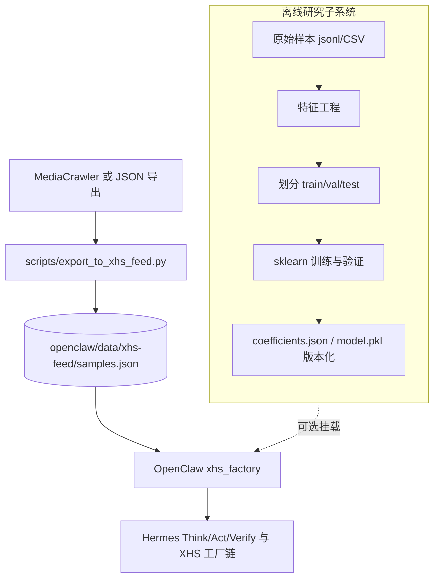

# 小红书爆文研究 — 现实条件版思路与架构

> **定位**：在《小红书爆文模型的科学化构建与验证研究报告》的**变量体系与建模原则**之下，结合本仓库**实际具备的数据源、工程栈与合规边界**，给出可执行的研究路径与系统架构。  
> **原则**：数据先于直觉、简单先于复杂、能测的才进模型；缺数据时用 **proxy（代理指标）** 并显式标注不确定性，不把「理想指标」伪装成已观测事实。

### 关于参考型《研究报告》的去幻觉与实验主文档

外部或 AI 辅助撰写的「研究报告」中，**精确准确率、回归系数、样本剔除细节**等若**未在你方原始数据与代码上复现**，在科学写作上应视为**不可引用**。  
**正式实验记录与模板**请以仓库内 **`research/EXPERIMENT_REPORT.md`** 为准；从数据导出到基线训练见 **`research/schema_notes.md`**、`scripts/export_features_v0.py`、`research/train_baseline_v0.py`。**「更贴近现实的公式」** = 在上述闭环中产出的、带 **样本量与 AUC 等指标** 的系数 JSON，而不是沿用任何外部文档里的乘法指数。

---

## 一、现实约束（与理想报告的差距）

| 维度 | 报告中的理想状态 | 本仓库/本地现实 |
|------|------------------|-----------------|
| 第三方数据 | 千瓜：搜索量、竞争度、曝光、CTR 等 | **通常不具备**稳定 API；是否采购由业务决定 |
| 平台全量后验 | 曝光、完播、漏斗转化 | **爬虫侧多为**点赞/收藏/评论/正文/部分账号字段；**曝光、完播多数不可得** |
| 样本设计 | 300+ 篇、多赛道、爆/非爆 1:1 | 可先 **MediaCrawler 拉取 + 人工或规则打标**；规模逐步扩 |
| 算力与模型 | TF-IDF + BERT 嵌入、随机森林/深度网络 | 本地可先做 **结构化特征 + sklearn**；BERT **可选**（离线批处理或云服务） |
| 与生产流水线关系 | 独立研究项目 | 需与 **`export_to_xhs_feed` → `xhs_factory` → Hermes/OpenClaw`** 衔接：研究在离线训，在线只 **加载系数/校准表** |

**结论**：研究报告的**方法论（变量定义 → 基线模型 → 验证 → 迭代）**应完整保留；**具体指标**要拆成「一期可做 / 二期补数 / 长期外包或采购」三档，避免研究停在纸面。

---

## 二、变量映射：理想指标 → 现实可得性与代理

对照报告 **§2.1 核心变量**，按下表落地（**P0**=不依赖千瓜也能做；**P1**=增强爬虫或账号页；**P2**=第三方或平台合作）。

| 报告变量类别 | 报告指标 | 现实优先级 | 本仓库侧实现思路 |
|--------------|----------|------------|------------------|
| 选题质量 | 搜索量、竞争度 | P2 | 一期：**省略或手工填列**（CSV 外挂）；二期：采购数据或固定关键词用公开搜索接口（注意 ToS） |
| 选题质量 | 需求强度（评论区真实提问） | P1 | 爬虫已有评论则：**规则/轻量分类**（含「求链接」「怎么用」等模式）；否则记缺失 |
| 内容质量 | CTR = 赞/曝光 | P2 | **无曝光则不可用**；P0 代理：**赞+收藏+评论 的秩或 log1p 组合**（仅可比「同采集批次」内相对热度，非 CTR） |
| 内容质量 | 完播率（报告：评/赞等） | P0 | **弱代理**；与真实完播不等价，仅作探索性特征，须在文档中声明偏差 |
| 内容质量 | 互动率 = (评+藏)/赞 | P0 | 字段齐即可算；注意除零 |
| 账号质量 | 粉丝互动率（7 天） | P1 | 需 **账号维度时间序列**；一期可用 **单条笔记互动/粉丝** 粗代理 |
| 账号质量 | 垂直度（30 篇占比） | P1 | 需 **账号历史笔记列表**；一期可省略或用 **话题标签一致性** 粗代理 |
| 动态 | 时间衰减 λ | P1 | 需 **同一笔记或多时点快照**；一期可只做 **笔记发布时间距今天数** |
| 动态 | 差异化指数 1−相似度 | P1/P2 | P0：**同批次 TF-IDF 余弦相似度**（仅文本）；BERT 嵌入为增强 |
| 动态 | 行为漏斗 | P2 | 无曝光则 **无法真漏斗**；一期用 **标题长度、首段长度、是否有 CTA 词** 作弱 proxy |

**标签 `is_viral`（是否与报告一致）**  
- 报告：≥1000 赞 vs ≤100 赞等。现实可按采集目的调整阈值，但必须在 **`data/labels_spec.json`或数据说明**里写死定义，避免混用多种定义。

---

## 三、分阶段研究路径（建议）

与报告 **线性 → 非线性 → 动态** 对齐，但**按数据到位情况**切阶段，而非一次上全量。

### 阶段 0：数据契约与可复现基线（当前即可做）

1. **固定标注定义**（爆文阈值、赛道字段、时间截断日期）。  
2. **统一特征表** `research/features_v0.csv`（或 Parquet）：一行一篇笔记，列 = P0 可算字段 + `is_viral` + `track`（赛道）。  
3. **基线模型**：逻辑回归或线性 SVM，特征标准化；输出系数表与 **测试集 AUC / F1**（样本少时以 **交叉验证** 为主）。  
4. **与现有工厂对齐**：`xhs_factory` 中 **`quantitative` / `score_breakdown`** 继续承担「可解释、无大模型」层；**不与 v0 模型混名**，避免把启发式当成训练模型。

### 阶段 1：扩展采集与 P1 特征

1. MediaCrawler / 自建导出：尽量 **稳定落库** `liked_count, collected_count, comment_count, share_count, fans, publish_time, comments_sample` 等。  
2. 实现 **评论需求强度**、**互动率**、**粗垂直度**；差异化用 **TF-IDF 相似度**（同赛道内 batch）。  
3. 重复报告中的 **相关性筛选、共线性检查**；权重用 **回归系数 + 随机森林 importance 双验证**（与报告 §2.4 一致）。

### 阶段 2：非线性、分赛道与衰减（数据 ≥200～300 有效样本再推进）

1. 报告中的 **乘法型 / 交互项** 可用 **对数化 + 线性模型** 或 **GAM / 浅层树模型** 近似，避免过拟合。  
2. **分赛道模型**：副业 / 本地 / 美妆等 **分别训或分层权重**（与报告 §4.3.2 一致）。  
3. **时间衰减**：有时序面板数据再估 λ；否则 **不强行拟合 λ**。

### 阶段 3：生产闭环（在线）

1. **离线**：训练好的 `model.pkl`（或系数 JSON）+ `feature_version`。  
2. **在线**：OpenClaw /独立微服务 **只读权重** 输出 `calibrated_viral_score`；**禁止**在请求路径上现训随机森林。  
3. **监控**：定期用新爬数据 **回测漂移**，触发重训（与报告 §6展望一致）。

---

## 四、系统架构（与现有仓库集成）

**架构说明（不依赖 Mermaid 时）**：爬虫/导出 → 合并为 `samples.json`；**离线**从同源数据建特征表、训练、产出权重；**在线** `xhs_factory` 以统计层与确定性打分为默认，**仅读取**已发布权重，不在请求路径上训练。

**设计要点**  
- **研究**与**在线启发式**共用同一套 **原始样本 schema**，但 **模型版本**与 **`xhs_factory` 内置公式** 解耦。  
- 第三方（千瓜等）若接入，放在 **离线 ETL**，写入特征表，不硬编码进 Docker镜像。

---

## 五、数据与工程清单（建议最小文件集）

| 产物 | 用途 |
|------|------|
| `research/schema_notes.md` | 每列含义、缺失策略、爆文定义 |
| `research/features_v0.{csv,parquet}` | 建模主表 |
| `research/train_report.md` | 每次训练的样本量、划分、指标、特征版本 |
| `openclaw/data/calibration/`（可选） | `weights_v{n}.json`，由 CI 或手工发布 |

（具体路径可按你习惯调整；关键是 **版本化 + 可复现**。）

---

## 六、对研究报告结论的使用方式（务实态度）

- 报告中的 **系数、R²、准确率 82%** 等，在**本仓库未用同一数据集复现前**，仅作**方法参照**，不宜直接写入生产配置。  
- 可优先采纳的是：**分赛道权重不同、差异化与时间衰减重要、漏斗/CTR 依赖真实曝光** 等 **定性结论**，并在变量表中用 P0/P1/P2 逐步落实。

---

## 七、下一步行动（可选优先级）

1. **定 `is_viral` 与赛道字段**（写进一小段数据说明）。  
2. **从现有 `samples.json` 导出 `features_v0`**（脚本 + 10 列以内起步）。  
3. **跑通一次 train/test + 保存系数**；再讨论是否把该分数 **挂进 `predict_viral_score` 的 optional 分支**。

---

*本文档与《小红书爆文模型的科学化构建与验证研究报告》配套使用：前者重**理想方法与验证规范**，本文重**在现有工程与数据条件下的落地架构与阶段边界**。*
