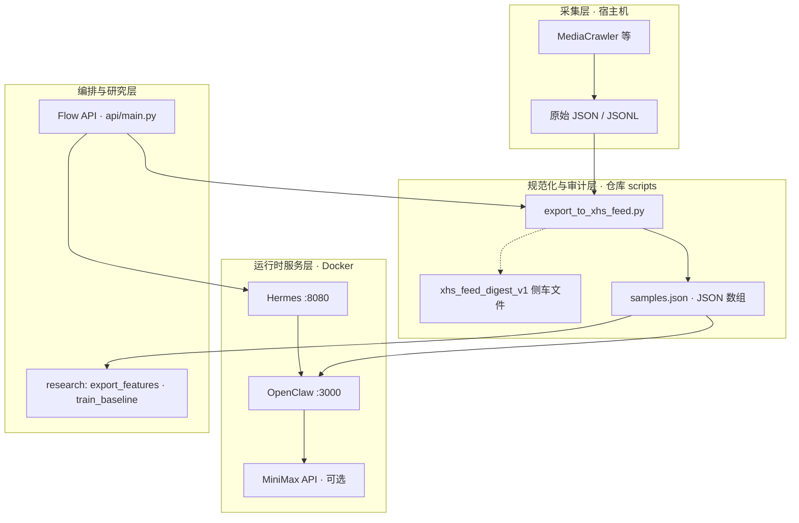

# 项目技术架构说明（`ai封装`）

> **文档角色**：用一张「总图 + 分层表 + 契约 + 配置」把本仓库的技术架构说清楚；与操作步骤（`使用说明书.md`）、数据路径（`kb/数据流与文件落点.md`）、实验记录（`research/EXPERIMENT_REPORT.md`）分工不同——**本文偏结构与集成，不替代逐步点击教程**。  
> **维护约定**：若你改了 `docker-compose.yml`、`.env.example`、`api/main.py` 的流水线、`export_to_xhs_feed` 的 digest 形态，请同步更新本文对应小节。

---

## 1. 系统要解决什么问题（边界）

| 在范围内 | 不在范围内（默认） |
|----------|-------------------|
| 把外部爬虫/导出物**规范化**为工厂可读的 Feed（JSON 数组） | 爬虫本身的登录、反爬、浏览器指纹（交给 MediaCrawler 等） |
| **OpenClaw** 侧小红书工厂：`extract` / `recreate` / `predict` / `prepare_xhs` 等算子 + MiniMax 文案 | 小红书 App 内真实发帖、投流后台 |
| **Hermes** 编排：任务、会话、与 OpenClaw 的 HTTP 调用、可选 Ollama 软审 | 通用多 Agent 平台替代方案 |
| **研究侧**：从同一份 `samples.json` 导出 `features_v0.csv`、训练可审计基线 JSON、可选挂进工厂 | 已复现的「外部研究报告」数字当结论 |
| **Flow API**（`api/main.py`）：本机串联导出 Feed、拉起容器、跑 bench 等 | 公网多租户 SaaS |

---

## 2. 逻辑架构（四层）

数据从采集到生成、再到研究与审计，可抽象为四层；**层与层之间只认 JSON/文件契约**，不直接依赖爬虫内部类。



**要点**：

- **L2** 是「薄」层：合并、去重、字段对齐、可选 **digest**（sha256 + merge_stats + batch_id），保证 Feed 可追溯。  
- **L3** 里 Hermes 不直接读 `samples.json`；**OpenClaw** 通过环境变量挂载路径读 Feed。  
- **L4** 中 Flow API 与 PowerShell 脚本一样，可以调用 **同一套** `export_to_xhs_feed.py`；研究与在线工厂**共用** `samples.json` 作为事实输入之一。

---

## 3. 运行时拓扑（Docker Compose）

定义文件：**`docker-compose.yml`**。默认两个长期服务：

| 服务 | 镜像构建上下文 | 默认对外端口 | 主要职责 |
|------|----------------|-------------|----------|
| **hermes** | `./hermes` | `8080`（`HERMES_HOST_PORT`可改） | 会话、任务 runner、调用 OpenClaw、可选 Ollama |
| **openclaw** | `./openclaw` | `3000`（`OPENCLAW_HOST_PORT` 可改） | 小红书工厂 HTTP API、读 Feed、调 MiniMax |

**关键卷与配置**（值在 `.env` 中覆盖）：

- Hermes：`HERMES_CONFIG_FILE` → 容器内 `/app/config.yaml`；`HERMES_SESSIONS_DIR` 会话目录。  
- Openclaw：`OPENCLAW_CONFIG_FILE` → `/app/config.yaml`；**`OPENCLAW_DATA_DIR`**（默认宿主机 `openclaw/data`）→容器 **`/app/data`**。  
  Feed 与基线 artifact 必须落在该数据卷下，容器内路径才一致（例如 `/app/data/xhs-feed/samples.json`、`/app/data/artifacts/baseline_v0.json`）。

**服务间调用**（环境变量，见 `.env.example`）：

- OpenClaw 内 **`HERMES_URL`**：指向 Hermes 服务名 `http://hermes:8080`（或你自定义的内部 URL）。  
- Hermes 内 **`OPENCLAW_URL`**：指向 OpenClaw `http://openclaw:3000`。

---

## 4. 仓库目录与模块职责（对照表）

| 路径 | 技术职责 | 关键入口 / 说明 |
|------|----------|-----------------|
| **`hermes/`** | 编排与质检（T-A-V-C 等） | FastAPI 应用、`config.yaml`、runner |
| **`openclaw/`** | 工厂与 LLM 调用 | `main.py` 路由、`xhs_factory.py`（归一样本、算子、`_fetch` 读 Feed）、`minimax_client` |
| **`openclaw/data/xhs-feed/`** | Feed 落地 | 常见 `samples.json`；可被 `XHS_FACTORY_SAMPLES_PATH` 或 `FEED_DIR` 指向 |
| **`scripts/export_to_xhs_feed.py`** | 原始 JSON(L) → 归一 JSON 数组 | `--dedupe`、`--digest-out`、`--batch-id`；stderr 打印 `merge_stats` |
| **`scripts/export_features_v0.py`** | `samples.json` → `research/features_v0.csv` | `--labels-spec`、`--feed-digest`、`--verify-samples-digest` |
| **`scripts/verify_features_labels_spec.py`** | 校验 CSV 中 `y_rule` 与契约阈值 | 退出码 0/1/2 |
| **`research/train_baseline_v0.py`** | 逻辑回归基线 + hold-out +可选 CV | 产出 `schema: feature_schema_v0` 的 JSON；`input_features_sha256`、`cross_validation` |
| **`api/main.py`** |本机 Flow API | `POST /api/export-feed`、`POST /api/model/evaluate`、`POST /api/run/full-pipeline`、`GET /api/config` 等 |
| **`scripts/promote_baseline.ps1`** | 基线 artifact 受控复制 | 与 evaluate 解耦；可选备份目录或 `-AllowOverwrite` |
| **`kb/`** | 渐进式 Wiki（解释、清单、路径） |非数据源；**`kb/数据流与文件落点.md`** 写具体盘符与脚本名 |

---

## 5. 数据契约（必须对齐的三类 JSON）

### 5.1 工厂 Feed：`samples.json`（JSON 数组）

- 每条记录经 **`openclaw/xhs_factory._normalize_external_sample`** 映射为内部统一字段：`title_hint`、`body_hint`、`like_proxy`、`sop_tag`、`emotion_tag`。  
- 上游别名表见 **`小红书数据与工厂-架构技术指南.md`** 第 4 节；示例见 **`openclaw/data/xhs-feed/samples.example.json`**。

### 5.2 合并审计：`xhs_feed_digest_v1`（侧车文件）

由 **`scripts/export_to_xhs_feed.py --digest-out`** 写出，**`scripts/export_features_v0.py --feed-digest`** 要求 `schema == xhs_feed_digest_v1` 且含字符串 **`sha256`**。

典型字段：

- `output_path`、`sha256`、`byte_length`、`merge_stats`（`raw_rows`、`empty_drop`、`dedup_drop`、`out`）、`dedupe`、`generated_at_utc`、可选 **`batch_id`**。

**语义**：digest 的 `sha256` 是**当前写入的 Feed 文件全文**的哈希；`export_features_v0 --verify-samples-digest` 对 `--samples` 再算一遍，必须与 digest 一致，避免「digest 与样本文件错配」。

### 5.3 研究特征表：`features_v0.csv`

列固定为 **`export_features_v0.py`** 中的 `fieldnames`（含 `row_index`、`title_len`、`body_len`、`like_proxy`、`log1p_like`、`sop_tag`、`emotion_tag`、`y_rule`、`batch_id`、`feed_digest_sha256`）。  
操作化定义见 **`research/schema_notes.md`**；标签契约模板 **`research/labels_spec.example.json`** → 本地 **`research/labels_spec.json`**（通常 gitignore）。

### 5.4 基线模型 artifact（训练输出 JSON）

由 **`train_baseline_v0.py`** 写出，顶层含：`schema: feature_schema_v0`、`feature_names`、`coefficients`、`intercept`、`holdout_roc_auc`、`holdout_brier_score`、`train_test_split`、`input_features_path`、`input_features_sha256`、`features_provenance`、可选 **`labels_spec`**、可选 **`cross_validation`**（`--cv-folds`）。  
工厂通过 **`XHS_FACTORY_BASELINE_JSON`** 挂载，与 **`linear_clamp_v1`** 按 **`XHS_FACTORY_BASELINE_MODE`**（`blend` / `replace` 等）组合；请求体中的 **`like_proxy_hint` / `like_proxy`** 仅影响 baseline 分支（见 `.env.example` 注释）。

---

## 6. 配置面：环境变量分组（`.env` / `.env.example`）

不必背全文，按「谁消费」记：

| 分组 | 代表变量 | 消费方 |
|------|----------|--------|
| OpenClaw Feed | `XHS_FACTORY_SAMPLES_PATH`、`XHS_FACTORY_FEED_DIR`、`XHS_FACTORY_FEED_URL` | `xhs_factory._fetch` |
| OpenClaw 基线 | `XHS_FACTORY_BASELINE_JSON`、`XHS_FACTORY_BASELINE_MODE`、`XHS_FACTORY_BASELINE_WEIGHT`、`XHS_FACTORY_BASELINE_ASSUMED_LIKE` | `xhs_factory` 预测路径 |
| MiniMax | `MINIMAX_*` | `openclaw` |
| Hermes | `HERMES_*`、`OLLAMA_HOST` 等 | `hermes` |
| Flow API / 合并脚本 | `FLOW_API_MEDIACRAWLER_JSONL`、`FLOW_API_FEED_OUT`、`FLOW_API_EXPORT_DEDUPE`、`FLOW_API_FEED_DIGEST_OUT`、`FLOW_API_FEED_BATCH_ID`、`FLOW_API_HERMES_URL`、`FLOW_API_OPENCLAW_URL` | `api/main.py`、`merge-xhs-feed.ps1` |
| 特征导出批次 | `EXPORT_FEATURES_BATCH_ID` | `export_features_v0.py`（优先级低于 CLI `--batch-id`） |

**Docker 与宿主机路径**：`.env` 里给 OpenClaw 的路径，在容器内应落在 **`/app/data/...`**，与 `OPENCLAW_DATA_DIR` 挂载一致。

---

## 7. 控制面：Flow API（`api/main.py`）在流水线中的位置

本机启动 Flow API 后（见 **`使用说明书.md`**），典型能力包括：

- **`GET /api/health`**、**`GET /api/config`**：健康与当前默认 `export_dedupe`、digest/batch 环境变量快照。  
- **`POST /api/export-feed`**：子进程执行 `export_to_xhs_feed.py`（Mediacrawler 目录 → `FLOW_API_FEED_OUT`），去重策略来自 query/body 或 `FLOW_API_EXPORT_DEDUPE`；digest/batch 来自 **`FLOW_API_FEED_DIGEST_OUT`** / **`FLOW_API_FEED_BATCH_ID`**；校验模式来自 **`FLOW_API_EXPORT_VALIDATE_MODE`**（及可选 **`FLOW_API_EXPORT_VALIDATE_SCHEMA`**）。  
- **`POST /api/model/evaluate`**：本机同步跑 `train_baseline_v0.py`，仅返回指标摘要并写 artifact；**不**自动部署；晋升用 **`scripts/promote_baseline.ps1`**。  
- **`POST /api/run/full-pipeline`**、**`POST /api/run/bench`**、**`POST /api/docker-up`**：与 bench脚本、容器生命周期串联。

**与 PowerShell 的关系**：`scripts/merge-xhs-feed.ps1` 与 API 使用**同一 Python 脚本参数语义**，便于计划任务与网页/HTTP 触发二选一或并存。

---

## 8. 研究流水线（与在线工厂并行）

同一份 **`samples.json`** 可走离线科学链路，**不经过** OpenClaw HTTP：

```text
samples.json
  → scripts/export_features_v0.py（--labels-spec，可选 --feed-digest --verify-samples-digest）
  → research/features_v0.csv
  → scripts/verify_features_labels_spec.py
  → research/train_baseline_v0.py（--cv-folds 5，可选）
  → research/artifacts/*.json
  →（可选）XHS_FACTORY_BASELINE_JSON 挂载进 OpenClaw
```

**混批防护**：`train_baseline_v0` 默认若发现多个 `batch_id` 或多个 `feed_digest_sha256` 会 **exit 2**，除非显式 **`--allow-mixed-batch`**；`features_provenance` 写入 artifact 便于审计。

---

## 9. 产出物落点（与 Git）

| 产出 | 典型路径 | 版本控制建议 |
|------|----------|--------------|
| Feed | `openclaw/data/xhs-feed/samples.json` | 大文件常 **不提交**；以 digest/批次记录为准 |
| Digest | 如 `samples.digest.json`（由你指定 `--digest-out`） | 可与 CI/任务 ID 绑定 |
| 特征 CSV | `research/features_v0.csv` | 默认 **gitignore** |
| 基线 JSON | `research/artifacts/*.json` | 默认 **gitignore**；结论进实验报告 |
| 生成文案 | `outputs/xhs-runs/*.txt` |按团队规范 |

---

## 10. 与其他文档如何配合阅读

| 需求 | 建议文档 |
|------|----------|
| **按盘符逐步对齐数据从哪来** | `kb/数据流与文件落点.md` |
| **勾选跑通 A→D** | `kb/跑通检查清单.md` |
| **数据与工厂方案边界、样本字段别名** | `小红书数据与工厂-架构技术指南.md` |
| **业务侧路线图与现实条件** | `小红书爆文研究-现实条件架构与路线图.md` |
| **实验怎么写、命令链、去幻觉** | `research/EXPERIMENT_REPORT.md` |
| **日常 Docker / bench / Flow** | `使用说明书.md` |
| **演进路线与外部方案取舍（数据门禁 / 模型发布 / 特征版本）** | 下文 **§11** |

---

## 11. 演进路线：外部参考意见的落地方式（与当前代码对齐）

以下对照「数据质量门禁 / 模型闭环 / 动态特征 / 版本与归因 / 隔离环境」等常见建议，说明**本仓库已经做了什么**、**哪些能接**、**哪些不宜照搬**（避免与 `title_hint` / `like_proxy` 的真实语义冲突）。

### 11.1 L2 层「数据清洗」——**已实现规则**（`export_to_xhs_feed.py`）

**渐进增强（已实现）**：`--validate-mode none|report|warn|fail`（默认 `none`）；可选 `--validate-schema` 指向 JSON Schema（仓库内默认 `scripts/schemas/xhs_feed_item_v1.schema.json`，若已 `pip install -r scripts/requirements-feed-tools.txt` 则优先用 **jsonschema** 校验，否则内置等价规则）。`fail` 模式下有违规时**不写** `--out` / digest。Flow API / 合并子进程可读 **`FLOW_API_EXPORT_VALIDATE_MODE`**、**`FLOW_API_EXPORT_VALIDATE_SCHEMA`**（与 `GET /api/config` 展示一致）。

合并脚本**不是**空壳：每条原始行经 **`_normalize_external_sample`**（与 `xhs_factory` 同源逻辑）后再入 Feed。当前行为可概括为：

| 环节 | 规则 | 统计口径 |
|------|------|----------|
| 空内容 | 归一后 `title_hint` 与 `body_hint` 若均为空（归一前也无可用 title/body 字段），**丢弃**该条 | `merge_stats.empty_drop` |
| 缺标题/正文 | 仅一侧为空时，用另一侧**截断补齐**（标题最长 500 字、正文 2000 字） | — |
| 点赞代理 | 从多别名字段解析整数；解析失败则默认 **100**；最终 **`like_proxy = max(1,值)`** |无单独计数 |
| 标签缺省 | `sop_tag` / `emotion_tag` 有默认中文占位 | — |
| 去重 | `--dedupe none|key|content`；`key` 优先稳定 id，否则退回正文指纹 | `dedup_drop` |
| 审计 | 可选 `--digest-out` + `--batch-id` | digest 内 `merge_stats` |

因此：若参考方案写「`assert sample["title"]` / `sample["body"]`」，与本仓库**字段名不一致**（应为归一后的 **`title_hint` / `body_hint`**，且上游可能是 `desc`、`note_text` 等别名）。若写「`like_proxy` 必须在 \[100, 1e6\]」，会**误杀**真实低赞笔记（本仓库允许 **≥1**，且缺失时默认 100）。

**建议的强化方向（与「稳 + 科学」一致）**：

1. **文档化**：在实验报告或数据说明中引用 **`merge_stats` + digest**，而不是再写一套未落地的 assert 伪代码。  
2. **可选 `--validate` /质检报告**（若实现）：宜输出 **计数与样本 id列表**（超长、异常类型），阈值应 **可配置**（YAML/JSON），或分 **warn vs hard-fail** 两档；默认行为须与现网「低赞、短标题」样本兼容。  
3. **更强门禁**：可对 **归一后** 结构做 JSON Schema 校验（`title_hint`/`body_hint`/`like_proxy` 类型与长度上界），与工厂消费契约一致。

### 11.2 模型迭代与「自动更新 `XHS_FACTORY_BASELINE_JSON`」

**缺口确实存在**：artifact 产出后，挂载路径仍依赖人工改 `.env` 或 Compose。

**不建议**照搬「AUC 提升 >5% 就自动改环境变量」：**hold-out 有噪声**；不同 `features_v0.csv` 混比会**泄漏信息**；直接写运行环境易造成**不可回滚的生产漂移**。

**更稳妥的闭环**（推荐演进顺序）：

1. **评估（已实现）**：`POST /api/model/evaluate` 同步调用 `research/train_baseline_v0.py`，返回 **`holdout_*`、`cross_validation`、`input_features_sha256`** 等摘要并写出 artifact；**不**修改 `XHS_FACTORY_BASELINE_JSON`。  
2. **晋升（已实现脚本）**：`scripts/promote_baseline.ps1 -Source ... -Target ...` 可选 **`-BackupDir`** 或 **`-AllowOverwrite`**，再人工确认容器挂载的 `XHS_FACTORY_BASELINE_JSON`。  
3. **可选 CI**：在专用机上串联 evaluate → 人工或门禁通过 → promote → `docker compose`，避免按单一 hold-out 自动晋升。

### 11.3 「动态特征」（时间衰减、漏斗、相似度）

**当前 `feature_schema v0` 刻意静态**：`export_features_v0.py` 只使用 `samples.json` 里**已有**字段派生长度、log 赞、标签等。

要增加参考表中的 `decay_score`、`click_to_read_rate`、`content_diff_score`，**前置条件**是 Feed 或侧车中**先有**可靠字段，例如：

- **时间**：`published_at` / `create_time`（统一时区与解析规则）；  
- **漏斗**：评论数、收藏数等（需爬虫/归一层写入归一结构，并在 `schema_notes.md` bump 版本）；  
- **相似度**：竞品语料与向量化管线（通常 **v1+** 独立实验，而非塞进 v0 一行补丁）。

**建议**：新增列时同步 **`feature_schema v1`**、`train_baseline_v0` 的 `feature_names` 白名单、工厂侧是否消费——避免「CSV 多了列但线上仍按旧系数」的静默错配。

### 11.4 特征版本控制（`feature_schema_version` 列）

在 CSV 中增加 **`feature_schema_version` 列**可行，但须约定：

- **训练脚本**只训练**单一版本**子表，或在 artifact 中写明 **`feature_schema_version` +所用列清单**；  
- **artifact** 顶层已有 **`schema: feature_schema_v0`**，升级时应 bump为 **`feature_schema_v1`** 并与工厂加载逻辑一致（见 `xhs_factory` 对 baseline JSON 的解析）。

「保留旧特征集做对比」更适合用 **Git 分支 / 不同 artifact文件名 / 实验编号**，而不是在同一 CSV 里混多版本却不分区训练。

### 11.5 模型归因（`feature_contributions`）

逻辑回归的「贡献度」**不能**随意写成固定小数和为 1 的 JSON：

- **系数符号与量纲**：`title_len` 与 `log1p_like` 尺度不同，直接比系数易误导。  
- **可行做法**：在 artifact 中增加 **`coefficients` 已存在**；可扩展 **标准化后的系数**、**hold-out 上的 permutation importance**、或 **分赛道分层系数**（需先定义赛道列）。  
- 若写 **`feature_contributions`**，须在报告中说明 **定义**（如基于绝对系数、还是基于边际效应），避免与 SHAP 等混称。

### 11.6 A/B 与隔离环境（`docker-compose.test.yml`）

用 **Compose override**（`-f docker-compose.yml -f docker-compose.test.yml`）拉起**独立端口、独立数据卷、独立 `HERMES_CONFIG_FILE`** 是合理方向；注意与现有 **`OPENCLAW_DATA_DIR`**、**`XHS_FACTORY_BASELINE_JSON`** 指向测试 artifact，避免与生产卷混用。

---

*版本：与当前仓库 `docker-compose.yml`、`scripts/export_to_xhs_feed.py`、`scripts/export_features_v0.py`、`research/train_baseline_v0.py`、`api/main.py` 行为对齐；§11 为演进与外部参考的**取舍说明**，非已全部实现的承诺。*
